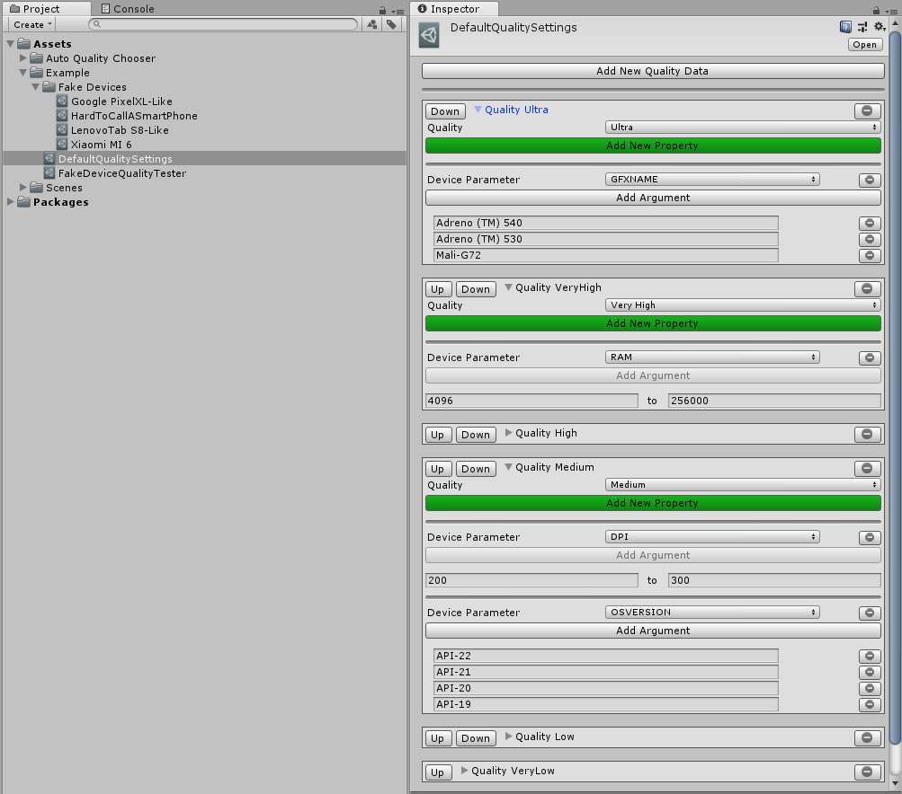

# autoquality-chooser
## About
This tool automatically takes device information and assigns a quality level that can be preconfigured by the user. You can customize which device information should belong to which quality. This tool is work in progress.
## How to Use
You can define quality settings and add device parameters and include arguments so system can detect and select one when running on a device. Currently, system reorganizes quality data from best(Ultra) to worst(Very Low) and crosschecks the device information starting from Ultra. You can select and add device parameters and arguments as many as you like, current parameters are:
• Model

• Ram

• CPU

• CPU architecture

• CPU count

• GFX name

• GFX vendor

• GFX shader

• GFX version

• Screen resolution

• DPI

• OS version



After you define your quality settings, press save. Then you can attach this scriptable object to one of your scripts that starts on initialization, and call:
```c#
QualitySettings.SetQualityLevel((int)_targetQualitySettings.CalculateQualitySettings());
```
### Retrieving Device Information And Adding As Fake Device
If you would like to test your quality settings in editor and see which device gets which quality settings, you can take a build while having **AutoQualityLogger** scripting define symbols added, and when you call ```CalculateQualitySettings()```, check your logcat and search for " ---Device Information---" you will see something like this: 
```
#TargetQualitySettings# ---Device Information---
Manufacturer : {Xiaomi}
Model : {MI 6}
Device : {sagit}
RAM : {3726}
CPU : {ARMv7 VFPv3 NEON}
CPU Architecture : {armv8l}
CPU Count  : {8}
-----
GFX Name  : {Adreno (TM) 540}
GFX Vendor : {Qualcomm}
GFX Shader : {50}
GFX Version : {OpenGL ES 3.2 V@269.0 (GIT@9c9b012, I92eb381bc9) (Date:12/31/17)}
-----
Screen : {1920 x 1080}
DPI : {480}
-----
Platform ID : {11}
OS Version : {Android OS 8.0.0 / API-26 (OPR1.170623.027/V10.0.1.0.OCAMIFH)}
Max Texture Size : {16384}
```

You can copy this and create a Fake Device Information from ```Right Clicking to anywhere in project window->Create->AutoQualityChooser->FakeDeviceTester->FakeDeviceInfo```. You can then paste device information that you've retrieved to it and click "Apply to fields", it will automatically distribute relevant information to the scriptable object. After that you can create Fake Device Quality Tester by ```Create->AutoQualityChooser->FakeDeviceTester->FakeDeviceQualityTester``` and attach the quality settings that you've prepared before, and fake device information that you've just prepared, and see what quality settings the device will receive.

